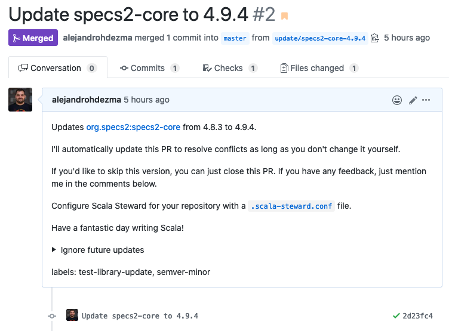

# Scala Steward Github Action

[](https://scala-steward.org)

A Github Action to launch [Scala Steward](https://github.com/scala-steward-org/scala-steward) in your repository.

<p align="center">
  <a href="https://github.com/scala-steward-org/scala-steward" target="_blank">
    
  </a>
</p>

## What does this action do?

When added, this action will launch [Scala Steward](https://github.com/scala-steward-org/scala-steward) on your own repository and create PRs to update your Scala dependencies using your own user:



## Usage

Create a new `.github/workflows/scala-steward.yml` file:

```yaml
# This workflow will launch at 00:00 every Sunday
on:
  schedule:
    - cron: '0 0 * * 0'

name: Launch Scala Steward

jobs:
  scala-steward:
    runs-on: ubuntu-latest
    name: Launch Scala Steward
    steps:
      - name: Launch Scala Steward
        uses: scala-steward-org/scala-steward-action@v2
        with:
          github-token: ${{ secrets.REPO_GITHUB_TOKEN }}
```

### How can I trigger a run?

You can manually trigger workflow runs using the [`workflow_dispatch` event](https://docs.github.com/en/free-pro-team@latest/actions/reference/events-that-trigger-workflows#workflow_dispatch):

```yaml
on:
  schedule:
    - cron: '0 0 * * 0'
  workflow_dispatch:
```

Once you added this trigger Github will show a "Run workflow" button at the workflow page.


## Configuration

The following inputs are available (all of them are optional):

| Input (click on name for description) | Allowed values | Default |
| :--- | :---: | :---: |
| <details><summary>`repos-file`</summary><br/>Path to a file containing the list of repositories to update in markdown format (- owner/repo)</details>| File paths | `''` |
| <details><summary>`github-repository`</summary><br/>Repository to update. The current repository will be used by default</details> | {{owner}}/{{repo}} | `$GITHUB_REPOSITORY` |
| <details><summary>`github-token`</summary><br/>Github Personal Access Token with permission to create branches on repo (or `${{ secrets.GITHUB_TOKEN }}`)</details> | Valid [Github Token](https://github.com/settings/tokens) | `''` |
| <details><summary>`author-email`</summary><br/>Author email address to use in commits</details> | Email address | Github user's *Public email* |
| <details><summary>`author-name`</summary><br/>Author name to use in commits</details> | String | Github user's *Name* |
| <details><summary>`scala-steward-version`</summary><br/>Scala Steward version to use</details> | Valid [Scala Steward's version](https://github.com/scala-steward-org/scala-steward/releases) | `0.13.0` |
| <details><summary>`ignore-opts-files`</summary><br/>Whether to ignore "opts" files (such as `.jvmopts` or `.sbtopts`) when found on repositories or not</details> | true/false | `true` |
| <details><summary>`sign-commits`</summary><br/>Whether to sign commits or not</details> | true/false | `false` |
| <details><summary>`signing-key`</summary><br/>Key ID of signing key to use for signing commits. Analogous to git's `user.signingkey` configuration setting.</details> | Signing key ID | ' ' |
| <details><summary>`cache-ttl`</summary><br/>TTL of cache for fetching dependency versions and metadata. Set it to `0s` to disable cache completely.</details> | like 24hours, 5min, 10s, or 0s | `2hours` |
| <details><summary>`timeout`</summary><br/>Timeout for external process invocations.</details> | like 2hours, 5min, 10s, or 0s | `20min` |
| <details><summary>`github-api-url`</summary><br/>The URL of the Github API, only use this input if you are using Github Enterprise</details> | https://git.yourcompany.com/api/v3 | `https://api.github.com` |
| <details><summary>`scalafix-migrations`</summary><br/>Scalafix migrations to run when updating dependencies. Check [here](https://github.com/scala-steward-org/scala-steward/blob/master/docs/scalafix-migrations.md) for more information.</details> | Path to HOCON file<br/>or remote URL<br/>with [migration](https://github.com/scala-steward-org/scala-steward/blob/master/docs/scalafix-migrations.md) | `''` |
| <details><summary>`artifact-migrations`</summary><br/>Artifact migrations to find newer dependency updates. Check [here](https://github.com/scala-steward-org/scala-steward/blob/master/docs/artifact-migrations.md) for more information.</details> | Path to HOCON file<br/>with [migration](https://github.com/scala-steward-org/scala-steward/blob/master/docs/artifact-migrations.md) | `''` |
| <details><summary>`github-app-id`</summary><br/>This input in combination with `github-app-key` allows you to use this action as a "backend" for your own Scala Steward GitHub App.</details> | A valid GitHub App ID | `''` |
| <details><summary>`github-app-key`</summary><br/>The private key for the GitHub App set with `github-app-id`. This value should be extracted from a secret. This input in combination with `github-app-id` allows you to use this action as a "backend" for your own Scala Steward GitHub App.</details> | A private key | `''` |
| <details><summary>`branches`</summary><br/>A comma-separated list of branches to update (if not provided, the repository's default branch will be updated instead). This option only has effect if updating the current repository or using the `github-repository` input. See ["Updating a custom branch"](#updating-a-custom-branch).</details>| A list of branches to update | `''` |
| <details><summary>`default-repo-conf`</summary><br/>The path to a [`.scala-steward.conf`](https://github.com/scala-steward-org/scala-steward/blob/master/docs/repo-specific-configuration.md) file with default values for all repos updated with this action.</details> | Path to a<br/>[`.scala-steward.conf`](https://github.com/scala-steward-org/scala-steward/blob/master/docs/repo-specific-configuration.md)<br/>default file | `.github/.scala-steward.conf` |

### Specify JVM version

If you would like to specify a specific Java version (e.g Java 11) please add the following step before `Launch Scala Steward`:
```
- name: Set up JDK 11
  uses: actions/setup-java@v1.3.0
  with:
    java-version: 1.11
```

### Github Token

There are several options for the Github Token:

#### Using the default Github Action Token

By default, the action will use the default GitHub Token if none is provided via `github-token`.

> Beware that if you use the default github-token [no workflows will run](https://docs.github.com/en/free-pro-team@latest/actions/reference/authentication-in-a-workflow#using-the-github_token-in-a-workflow) on Scala Steward PRs.

#### Using a Personal Access Token

1. You will need to generate a [Github Personal Access Token](https://github.com/settings/tokens) with `repo` permissions for reading/writing in the repository/repositories you wish to update.
2. Add it as a repository secret.
3. Provide it to the action using `github-token` input:

```yaml
- name: Launch Scala Steward
  uses: scala-steward-org/scala-steward-action@v2
  with:
    github-token: ${{ secrets.REPO_GITHUB_TOKEN }}
```

##### Note on Github User account

The [Github Personal Access Token](https://github.com/settings/tokens) can be created under your own Github user account, or under a separate account that has [Collaborator](https://help.github.com/en/github/setting-up-and-managing-your-github-user-account/inviting-collaborators-to-a-personal-repository) permission in the repository/repositories you wish to update.

Make sure the account you choose has *Name* and *Public email* fields defined in [Public Profile](https://github.com/settings/profile) -- they will be using by Scala Steward to make commits.
If the account has [personal email address protection](https://help.github.com/en/github/setting-up-and-managing-your-github-user-account/blocking-command-line-pushes-that-expose-your-personal-email-address) enabled, then you will need to explicitly specify a email to use in commits:

```yaml
- name: Launch Scala Steward
  uses: scala-steward-org/scala-steward-action@v2
  with:
    github-token: ${{ secrets.REPO_GITHUB_TOKEN }}
    author-email: 12345+octocat@users.noreply.github.com
```

#### Using a Github App installation tokens

You can create a Github App with write access, install it in the repositories you want to update and use it to generate installation access tokens. See detailed instructions [below](#using-a-github-app-to-author-pull-requests).

### Updating one repository

To update only one repository we can use the `github-repository` input. Just set it to the name (owner/repo) of the repository you would like to update.

```yaml
- name: Launch Scala Steward
  uses: scala-steward-org/scala-steward-action@v2
  with:
    github-token: ${{ secrets.REPO_GITHUB_TOKEN }}
    github-repository: owner/repository
```

> This input isn't required if the workflow launches from the same repository that you wish to update.

### Updating multiple repositories

To update multiple repositories you can either maintain the list in a markdown file or use a Github app that you can install in each repository you want to update.

#### Using a file to list repositories

1. Create a file containing the list of repositories in markdown format:

    ```markdown
    # repos.md
    - owner/repo_1
    - owner/repo_2
    ```

2. Put that file inside the repository directory (so it is accessible to Scala Steward's action).
3. Provide it to the action using `repos-file`:

    ```yaml
    # Need to checkout to read the markdown file
    - uses: actions/checkout@v2
    - name: Launch Scala Steward
      uses: scala-steward-org/scala-steward-action@v2
      with:
        github-token: ${{ secrets.REPO_GITHUB_TOKEN }}
        repos-file: 'repos.md'
    ```

> This input (if present) will always take precedence over `github-repository`.

#### Using a Github App to list repositories

You can create your own Scala Steward GitHub App and use this action as a backend for it:

1. [Create a new Github App](https://docs.github.com/en/developers/apps/creating-a-github-app)
2. The only permission you need for this app is `Metadata: read-only`. See more detailed setup instructions [here](https://github.com/scala-steward-org/scala-steward/pull/1766).
3. Once you do that you will get an App ID and will be able to generate a private key file.
4. Save the content of that private key file to a repository secret.
5. Add your App ID and your secret to the scala-steward-action:

```yaml
- name: Launch Scala Steward
  uses: scala-steward-org/scala-steward-action@v2
  with:
    github-token: ${{ secrets.REPO_GITHUB_TOKEN }}
    github-app-id: 123456
    github-app-key: ${{ secrets.APP_PRIVATE_KEY }}
```

Now Scala Steward will use Github API to list all app installations and run updates on those repositories.

##### Using a Github App to author pull requests

You can also use a Github App to author update pull requests. It can be the same app as above or a different one.
To be able to create branches and pull requests it needs these permissions:

- `Contents: read & write`
- `Pull requests: read & write`

Then you can use an action like [tibdex/github-app-token](https://github.com/tibdex/github-app-token) to generate an [installation access token](https://docs.github.com/en/developers/apps/authenticating-with-github-apps#authenticating-as-an-installation) and pass it to the scala-steward-action:

```yaml
- name: Generate token
  id: generate-token
  uses: tibdex/github-app-token@v1
  with:
    app_id: 123456
    private_key: ${{ secrets.APP_PRIVATE_KEY }}

- name: Launch Scala Steward
  uses: scala-steward-org/scala-steward-action@v2
  with:
    # used for authoring updates:
    github-token: ${{ steps.generate-token.outputs.token }}
    author-email: 123456+app-name[bot]@users.noreply.github.com
    author-name: app-name[bot]
    # used for listing repositories (optional, can be a different app):
    github-app-id: 123456
    github-app-key: ${{ secrets.APP_PRIVATE_KEY }}
```

- `author-*` inputs are optional here: if you don't add them, pull requests will be authored by your app, but commits will be authored by the `@github-actions[bot]` account.
    App email is constructed from the app ID, app name and the `[bot]` suffix ([details](https://github.community/t/logging-into-git-as-a-github-app/115916/2)).
- `github-app-*` inputs are also optional. If you have an app with write access to many repositories, but want to enable Scala Steward only in some of them, then you can use `repos-file` or another app with minimal permissions just to mark reposities for updates.
- The app used to author updates has to be also installed in the repository where the action is running from, otherwise the first step won't be able to generate tokens.

### Updating a custom branch

By default, Scala Steward uses the repository's default branch to make the updates. If you want to customize that behavior, you can use the `branches` input:

```yml
- name: Launch Scala Steward
  uses: scala-steward-org/scala-steward-action@v2
  with:
    github-token: ${{ github.token }}
    branches: main,0.1.x,0.2.x
```

Take into account that this input is only used if updating the repository where the action is
being run or using the `github-repository` input. For cases where the `repos-file` input is used, you
should follow the instructions [here](https://github.com/scala-steward-org/scala-steward/blob/master/docs/faq.md#can-scala-steward-update-multiple-branches-in-a-repository) and add multiple lines in the markdown file like:

```md
- repo/owner # updates default branch
- repo/owner:0.1.x # updates 0.1.x branch
- repo/owner:0.2.x # updates 0.2.x branch
```

### GPG

If you want commits created by Scala Steward to be automatically signed with a GPG key, follow these steps:

1. Generate a new GPG key following [Github's own tutorial](https://help.github.com/en/github/authenticating-to-github/generating-a-new-gpg-key).
2. Add your new GPG key to your [user's Github account](https://github.com/settings/keys) following [Github's own tutorial](https://help.github.com/en/github/authenticating-to-github/adding-a-new-gpg-key-to-your-github-account).
3. Export the GPG private key as an ASCII armored version to your clipboard (change `joe@foo.bar` with your key email address):

    ```bash
    # macOS
    gpg --armor --export-secret-key joe@foo.bar | pbcopy

    # Ubuntu (assuming GNU base64)
    gpg --armor --export-secret-key joe@foo.bar -w0 | xclip

    # Arch
    gpg --armor --export-secret-key joe@foo.bar | sed -z 's;\n;;g' | xclip -selection clipboard -i

    # FreeBSD (assuming BSD base64)
    gpg --armor --export-secret-key joe@foo.bar | xclip
    ```

4. Paste your clipboard as a new `GPG_PRIVATE_KEY` repository secret.
5. If the key is passphrase protected, add the passphrase as another repository secret called `GPG_PASSPHRASE`.
6. Import it to the workflow using an action such us [crazy-max/ghaction-import-gpg](https://github.com/crazy-max/ghaction-import-gpg):

    ```yaml
    - name: Import GPG key
      uses: crazy-max/ghaction-import-gpg@v2
      with:
        git_user_signingkey: true
      env:
        GPG_PRIVATE_KEY: ${{ secrets.GPG_PRIVATE_KEY }}
        PASSPHRASE:      ${{ secrets.GPG_PASSPHRASE }}
    ```

7. Tell Scala Steward to sign commits using the `sign-commits` input:

    ```yaml
    - name: Launch Scala Steward
      uses: scala-steward-org/scala-steward-action@v2
      with:
        github-token: ${{ secrets.REPO_GITHUB_TOKEN }}
        sign-commits: true
    ```

8. Tell Scala Steward the key ID of the key to be used for signing commits using the `signing-key` input:

   1. Obtain the key ID for the key that should be used. For instance, in the following example, the GPG key ID is
      3AA5C34371567BD2:

      ```
      $ gpg --list-secret-keys --keyid-format=long
      /Users/hubot/.gnupg/secring.gpg
      ------------------------------------
      sec   4096R/3AA5C34371567BD2 2016-03-10 [expires: 2017-03-10]
      uid                          Hubot
      ssb   4096R/42B317FD4BA89E7A 2016-03-10
      ```

   3. Copy the key ID and paste it as the content of a new repository secret, called for example `GPG_SIGNING_KEY_ID`.

   4. Use the `signing-key` parameter to allow Scala Steward to use the correct key:

      ```yaml
      - name: Launch Scala Steward
        uses: scala-steward-org/scala-steward-action@v2
        with:
          github-token: ${{ secrets.REPO_GITHUB_TOKEN }}
          sign-commits: true
          signing-key: ${{ secrets.GPG_SIGNING_KEY_ID }}
      ```


9. **Optional**. By default, Scala Steward will use the email/name of the user that created the token added in `github-token`, if you want to override that behavior, you can use `author-email`/`author-name` inputs, for example with the values extracted from the imported private key:

    ```yaml
    - name: Launch Scala Steward
      uses: scala-steward-org/scala-steward-action@v2
      with:
        github-token: ${{ secrets.REPO_GITHUB_TOKEN }}
        sign-commits: true
        author-email: ${{ steps.import_gpg.outputs.email }}
        author-name: ${{ steps.import_gpg.outputs.name }}
    ```

### Ignoring OPTS files

By default, Scala Steward will ignore "opts" files (such as `.jvmopts` or `.sbtopts`) when found on repositories, if you want to disable this feature, use the `ignore-opts-files` input:

```yaml
- name: Launch Scala Steward
  uses: scala-steward-org/scala-steward-action@v2
  with:
    github-token: ${{ secrets.REPO_GITHUB_TOKEN }}
    ignore-opts-files: false
```

### Run Scala Steward in debug mode

You just need to enable [GitHub Actions' "step debug logging"](https://docs.github.com/en/actions/monitoring-and-troubleshooting-workflows/enabling-debug-logging#enabling-step-debug-logging) and Scala Steward will start automatically in debug mode too.

For this you must set the following secret in the repository that contains the workflow: `ACTIONS_STEP_DEBUG` to `true` (as stated in GitHub's documentation).

## Contributors ✨

Thanks goes to these wonderful people ([emoji key](https://allcontributors.org/docs/en/emoji-key)):

<!-- ALL-CONTRIBUTORS-LIST:START - Do not remove or modify this section -->
<!-- prettier-ignore-start -->
<!-- markdownlint-disable -->
<table>
  <tr>
    <td align="center"><a href="https://alejandrohdezma.com/"><br /><sub><b>Alejandro Hernández</b></sub></a><br /><a href="https://github.com/scala-steward-org/scala-steward-action/commits?author=alejandrohdezma" title="Code">💻</a></td>
    <td align="center"><a href="https://github.com/laughedelic"><br /><sub><b>Alexey Alekhin</b></sub></a><br /><a href="https://github.com/scala-steward-org/scala-steward-action/commits?author=laughedelic" title="Code">💻</a></td>
    <td align="center"><a href="https://github.com/fthomas"><br /><sub><b>Frank Thomas</b></sub></a><br /><a href="https://github.com/scala-steward-org/scala-steward-action/commits?author=fthomas" title="Code">💻</a></td>
    <td align="center"><a href="https://github.com/ryota0624"><br /><sub><b>ryota0624</b></sub></a><br /><a href="https://github.com/scala-steward-org/scala-steward-action/commits?author=ryota0624" title="Code">💻</a></td>
    <td align="center"><a href="https://github.com/arashi01"><br /><sub><b>Ali Salim Rashid</b></sub></a><br /><a href="https://github.com/scala-steward-org/scala-steward-action/commits?author=arashi01" title="Code">💻</a></td>
    <td align="center"><a href="https://twitter.com/xuwei_k"><br /><sub><b>kenji yoshida</b></sub></a><br /><a href="https://github.com/scala-steward-org/scala-steward-action/commits?author=xuwei-k" title="Code">💻</a></td>
    <td align="center"><a href="https://github.com/EwoutH"><br /><sub><b>Ewout ter Hoeven</b></sub></a><br /><a href="https://github.com/scala-steward-org/scala-steward-action/commits?author=EwoutH" title="Code">💻</a></td>
  </tr>
  <tr>
    <td align="center"><a href="http://victor.sollerhed.se/"><br /><sub><b>Victor Sollerhed</b></sub></a><br /><a href="https://github.com/scala-steward-org/scala-steward-action/commits?author=MPV" title="Code">💻</a></td>
    <td align="center"><a href="https://www.nomadblacky.dev/"><br /><sub><b>Takumi Kadowaki</b></sub></a><br /><a href="https://github.com/scala-steward-org/scala-steward-action/commits?author=NomadBlacky" title="Code">💻</a></td>
    <td align="center"><a href="https://toniogela.dev/"><br /><sub><b>Antonio Gelameris</b></sub></a><br /><a href="https://github.com/scala-steward-org/scala-steward-action/commits?author=TonioGela" title="Code">💻</a></td>
    <td align="center"><a href="http://ca.linkedin.com/in/pboldyrev/"><br /><sub><b>Pavel Boldyrev</b></sub></a><br /><a href="https://github.com/scala-steward-org/scala-steward-action/commits?author=bpg" title="Code">💻</a></td>
  </tr>
</table>

<!-- markdownlint-restore -->
<!-- prettier-ignore-end -->

<!-- ALL-CONTRIBUTORS-LIST:END -->

This project follows the [all-contributors](https://github.com/all-contributors/all-contributors) specification. Contributions of any kind welcome!

## License

Scala Steward Action is licensed under the Apache License, Version 2.0.
